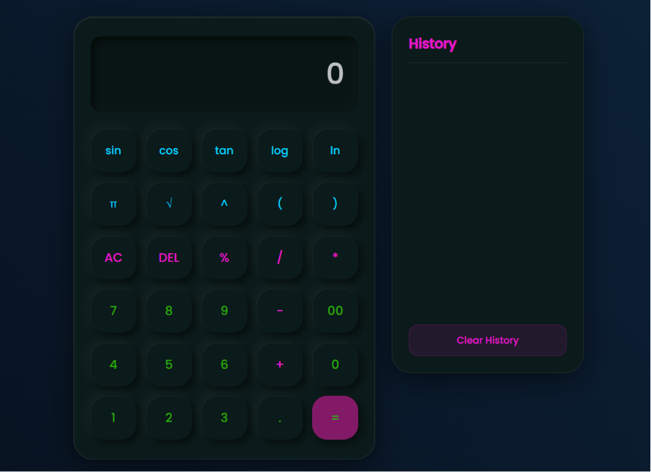
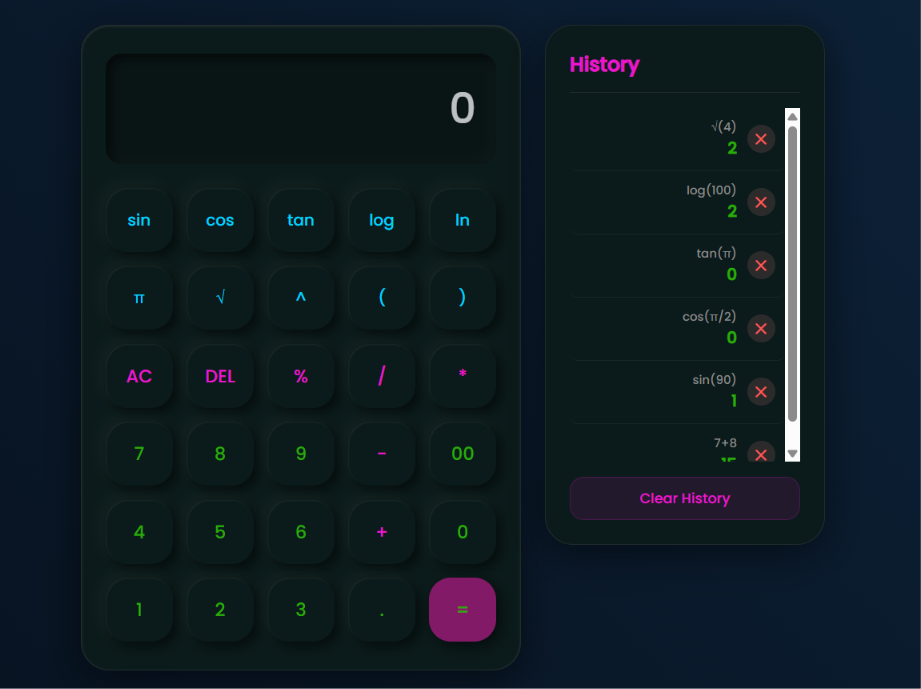

# 🧮 Scientific Calculator

A responsive **Scientific Calculator** built using **HTML, CSS, and JavaScript**. It supports basic and scientific calculations, keyboard shortcuts, calculation history, and local storage for a better user experience.

## 🌐 Live Demo
🔗 [View Live Project](https://calcnova-web.netlify.app/)

## 🚀 Features

- Basic arithmetic operations
  - Addition (+)
  - Subtraction (-)
  - Multiplication (*)
  - Division (/)
  - Percentage (%)
  - Power (^)

- Scientific functions
  - sin()
  - cos()
  - tan()
  - log()
  - ln()
  - Square Root (√)
  - Pi (π)

- Prevents invalid inputs
- Saves calculation history
- Delete individual history entries
- Clear calculation history
- Local Storage support
- Keyboard support
- Responsive design for desktop, tablet, and mobile devices

## 📂 Project Structure

```
Scientific_Calculator/
├── index.html
├── calculator.css
├── calculator.js
└── README.md
```

## 🛠️ Technologies Used

- HTML5
- CSS3
- JavaScript (ES6)
- Local Storage API

## 📸 Preview

### Calculator Interface:


### Calculation History:


## ⚙️ Installation

1. Clone the repository:

```bash
git clone https://github.com/Jyoti-Prakash-Patra/Scientific_Calculator.git
```

2. Go to the project directory:

```bash
cd Scientific_Calculator
```

3. Open the `index.html` file in your preferred web browser.

> **Note:** No additional installation or dependencies are required.

## 🎯 Usage

- Click the calculator buttons to perform calculations.
- Use your keyboard for faster input.
- Press **Enter** to calculate.
- Press **Backspace** to delete the last character.
- Press **Escape** to clear the display.
- Click any history item to reuse its result.
- Delete individual history items or clear the entire history.

## 📱 Responsive Design

The calculator is optimized for the following screen sizes:

- Desktop
- Laptop
- Tablet
- Mobile devices
- Small screen devices

## 📌 Supported Functions

| **Function**     | **Example** |
|------------------|-------------|
| Addition         | `10 + 5`    |
| Subtraction      | `20 - 8`    |
| Multiplication   | `8 * 6`     |
| Division         | `25 / 5`    |
| Percentage       | `50%`       |
| Power            | `2^5`       |
| Square Root      | `√(25)`     |
| Logarithm        | `log(100)`  |
| Natural Log      | `ln(5)`     |
| Sine             | `sin(30)`   |
| Cosine           | `cos(60)`   |
| Tangent          | `tan(45)`   |
| Pi               | `π`         |

## 💾 History Feature

The calculator stores previous calculations using the browser's **Local Storage**.

You can:

- View previous calculations
- Reuse previous results
- Delete individual history entries
- Clear the complete history

## ⌨️ Keyboard Shortcuts

| Key | Description |
| :-- | :---------- |
| `0–9` | Enter numbers |
| `+`, `-`, `*`, `/`, `%` | Perform arithmetic operations |
| `.` | Insert a decimal point |
| `Enter` | Evaluate the expression |
| `Backspace` | Delete the last character |
| `Escape` | Clear the calculator display |

## 👨‍💻 Author

**Jyoti Prakash Patra**

- **GitHub:** https://github.com/Jyoti-Prakash-Patra
- **LinkedIn:** https://www.linkedin.com/in/jyoti-prakash-patra/

<br>

> Feel free to use, modify, and explore this project for learning and personal purposes.